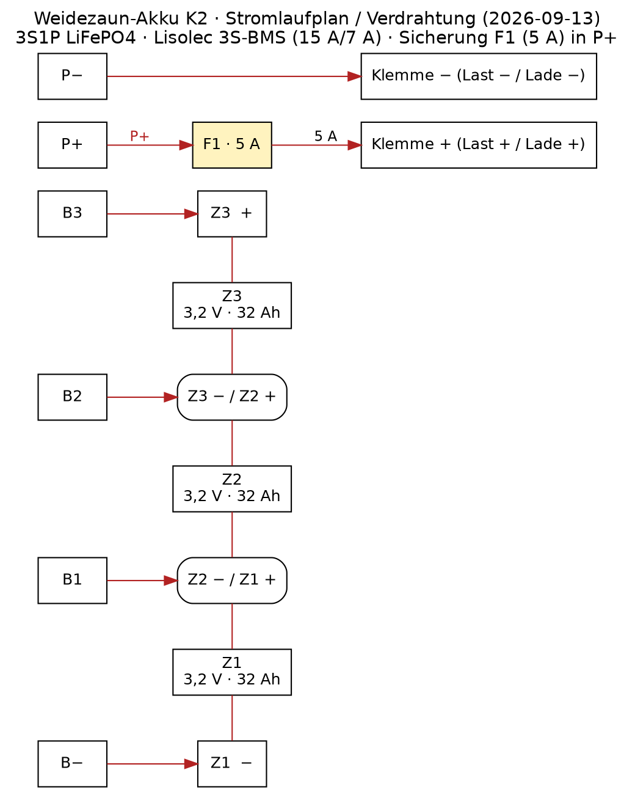

# Umsetzung · Verdrahtung (build)

| | |
|---|---|
| Verzeichnis | `build/` |
| Zweck | Verdrahtungsplan und Anschluss-Doku des Akku-Packs K2 (3S1P) |
| Stand | 2026-09-13 (angelegt) |
| Bezug | `docs/03_spezifikation_architektur_physisch.md` (PE-01…PE-12, PF-01…PF-13), `specs-cmp/K2_zellen.md`, `specs-cmp/K2_bms.md` |

## Topologie

- **3S1P**: 3 × VariCore 3,2 V / 32 Ah LiFePO4 in Serie: 9,6 V Nenn, 7,5–10,95 V Pack.
- **BMS-Anschlussbild (verbaut, 2026-09-13):** Pads `B-`, `B1`, `B2`, `B3` (drei Serien-
  positionen) sowie `P-` / `P+` für den Last-/Lade-Anschluss.

## Verdrahtungsplan (Referenz)



*Quelle/Regenerierung:* `img/verdrahtung.dot` (Graphviz) — Ableitung SVG/PNG über
`dot -Tsvg/png`. Enthalten: Zellblock 3S (Taps B−/B1/B2/B3), Lisolec-BMS,
Sicherung F1 (5 A in P+), Common-Port-Anschluss PE-07.

Klemmenzuordnung — **jedes B-Pad gehört zum Pluspol der jeweiligen Serienzelle:**

| von | nach | Bedeutung |
|-----|------|-----------|
| Z1 − | B− | Pack− (unterster Anker, Bezugsmasse) |
| Z1 + (= Z2 −) | **B1** | Mittelabgriff zwischen Z1 und Z2 |
| Z2 + (= Z3 −) | **B2** | Mittelabgriff zwischen Z2 und Z3 |
| Z3 + | **B3** | Pack+ (oberste Serienposition) |
| BMS **P+** | → Sicherung (F1) → PE-07 Klemme + | Last + / Lade + |
| BMS **P−** | → PE-07 Klemme − | Last − / Lade − |

```
Zellblock 3S                          BMS              Last / Lade
──────────────                        ───              ─────────────
Pack+   Z3 + ◄──► Z3 − ─────────◆────► B3
                Z2 + ◄──► Z2 − ──◆────► B2
                Z1 + ◄──► Z1 − ──◆────► B1
Pack−              Z1 − ────◆────────► B−
                                                    P+ ─[(F1)]──► PE-07 (+)
                                                    P− ──────────► PE-07 (−)
```

> Lesart: Z1− → B−, Z1+ → B1, Z2+ → B2, Z3+ → B3. Die Zellen sind in Serie
> verbunden (Z1+/Z2− gemeinsamer Knoten, Z2+/Z3− gemeinsamer Knoten).

**P+ / P− bilden den gemeinsamen Last-/Ladeanschluss (Common Port):**
- **Laden:** PE-02 (Ladebuchse) → Laderegler → P+ / P− (über F1 in P+)
- **Entladen:** P+ / P− → PE-07 (Zaugerät-Klemmen)

> **F1** = **Sicherung 5 A** in der **P+-Leitung** (Vorgabe Nutzer, fixiert 2026-09-13) —
> schützt den Plus-Pfad vor Kurzschluss/Überstrom zusätzlich zur BMS-Lastschaltung
> (PE-06). Deutlich über der Betriebslast (30–60 mA + Pulse), unter der
> Kabel-/MOS-Extrembelastung; Charakteristik beim Aufbau abschließend wählen.

> Anschlussreihenfolge und Spannungsanker je Serienposition beim Verdrahten messen
> (3-S-Spannungsprofil M1 gemäß docs/06, Eintrag in `DATENBLATT_AKKU.md` §6).

## Querschnitte / Kontakte

> Beim Zusammenbau festlegen und hier dokumentieren (Zell-Verschraubung/-Verbindung,
> BMS-Balancer-Anschlüsse, Last-/Ladekabel, **F1-Wert/Charakteristik**).

## Sicherheit

- **Sicherung F1 (5 A) in der P+-Leitung** (Vorgabe Nutzer, fixiert 2026-09-13) —
  Plus-Pfad zusätzlich abgesichert.
- Verpolungsschutz: PE-02-Eingangsschutz + mech. Klemmen-Sicherung (S-04).
- Lastschalter PE-06 (BMS-P−) im Normalbetrieb einlassend, im Fehlerfall trennend.
- Verdrahtungsreihenfolge: Zell-Balancer (B1/B2/B3 zuletzt) zum Vermeiden falscher
  Tap-Anbindung; Spannung je Tap vor Anschluss gegen B− prüfen (M1-Profil).

## Control Records

- (leer — bei Verdrahtung inkl. Datum und Messwerten ergänzen)

## Tracker

- [ ] Verdrahtungsplan final
- [ ] Verdrahtung durchgeführt
- [ ] Durchgangs-/Polprüfung
- [ ] Funktionsprobe